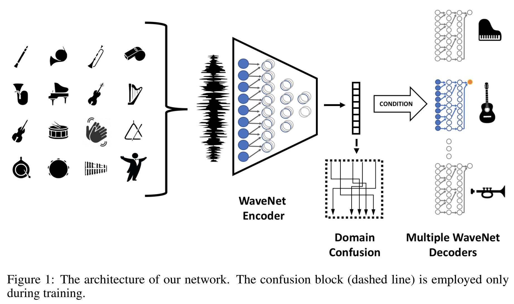

# A Universal Music Translation Network Implementation

References

A Universal Music Translation Network 
https://arxiv.org/abs/1805.07848

WaveNet: A Generative Model for Raw Audio
https://arxiv.org/abs/1609.03499

Domain-Adversarial Training of Neural Networks
https://arxiv.org/abs/1505.07818
